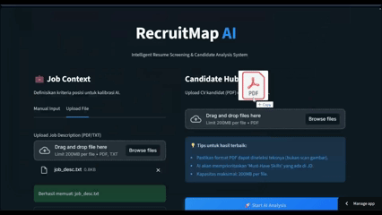

# RecruitMap: AI-Powered Talent Screening System

  <a href="https://recruitmap.streamlit.app">
    <b> ➡️ Try RecruitMap Now ⬅️ </b>
  </a>

**RecruitMap** is an intelligent screening assistant designed to help HR teams filter candidates objectively using Large Language Models (LLM). Unlike traditional keyword matching (ATS), RecruitMap understands context, evaluates "Must-have" vs "Nice-to-have" skills, and generates structured screening notes instantly.

## Key Features

### 1. Context-Aware AI Scoring
Powered by **Google Gemini 2.0 Flash Lite**, the system analyzes the semantic meaning of resumes against complex Job Descriptions. 

### 2. Structured Data Extraction
Utilizes **Pydantic** for strict schema validation, ensuring 100% valid JSON output. The system extracts:
* **Match Score (0-100)** with visual progress bars.
* **Hiring Decision:** Shortlist / Potential / Reject.
* **Missing Critical Skills:** Highlighted as "Danger Tags" for quick scanning.

### 3. Modern SaaS Experience
* **Split-View Interface:** Input Job Context and Upload Resumes side-by-side.
* **Smart Auto-Scroll:** UX enhancements that guide users directly to results.
* **Visual Insights:** Interactive candidate cards with Interview Prep questions.

---

## Tech Stack

| Component | Technology | Why? |
| :--- | :--- | :--- |
| **Orchestration** | Python & Streamlit | Rapid prototyping with reactive data flow. |
| **AI Engine** | **Google Gemini 2.0 Flash Lite** | Bleeding-edge speed and context window for batch processing. |
| **Data Validation** | **Pydantic** | Enforcing strict typing for reliable backend logic. |
| **PDF Parsing** | PyMuPDF (Fitz) | High-fidelity text extraction from complex PDF layouts. |
| **Styling** | Custom CSS3 | Overriding default styles for a polished "Dark Mode" SaaS look. |

---

> *This repository is a personal project used for learning and experimentation. I am actively refining the codebase and have several features planned for future updates.*
